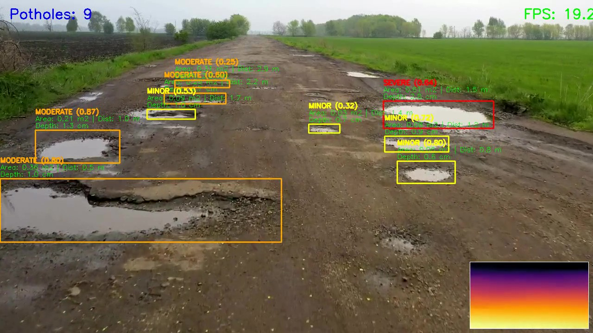
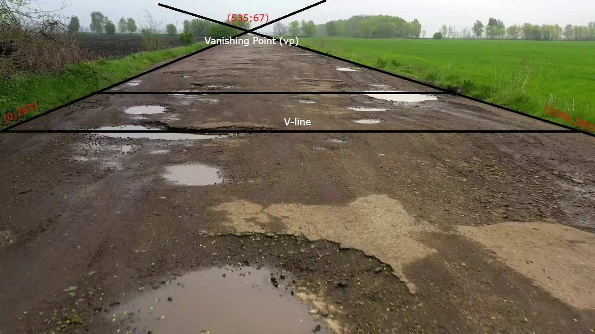

# 🕳️ Real-Time Pothole Detection, Depth & Area Estimation on Edge CPU

<p align="center">
  <video src="runs/inference_pipeline/pipeline_demo_origin.mp4" width="1200px" autoplay loop muted playsinline></video>
</p>
<p align="center">
  
</p>

---

## 1. 📝 Research Overview & Problem Statement

This project focuses on addressing the challenge of **Real-Time Detection and Physical Measurement (Depth, Surface Area) of pavement distresses (potholes)** to support Active Road Safety systems in autonomous electric vehicles.

The proposed solution utilizes a single **Monocular Camera** and implements a mathematically optimized computational pipeline running end-to-end on **Edge CPUs** (requiring no GPU resources), leveraging **ONNX Runtime** to achieve real-time inference speed ($\ge 15\text{ FPS}$) combined with exceptional geometric accuracy.

---

## 2. 🛠️ Methodology & System Architecture

The system architecture is developed based on a **Monocular Camera Approach (Optimized for Edge CPU)** to achieve an optimal balance between highly constrained computational resources and precise geometric measurements:

### 2.1 🎯 Object Detection Module
*   **Inference Engine:** Employs the **YOLOv8-nano** architecture, utilizing computational graph optimization and exporting to `.onnx` format to maximize multi-threaded execution on host CPUs.
*   **Training Strategy (Fine-tuning):** Implements high-intensity data augmentation techniques (`Mosaic`, `Mixup`, `HSV` color space jittering, and `Random Erasing`) to robustly simulate adverse environmental conditions (low-light nighttime, localized shadows, rain clutter, and high-contrast sunlight).
*   **Severity Grading Scheme:** Instantiates a hazard assessment framework for detected anomalies based on two measured physical parameters (Surface Area $Area$ and absolute Depth $Depth$), which is systematically aligned with the codebase logic in (`src/pipeline/depth_area_estimator.py`):
    *   🔴 **`severe` (Critical):** Surface Area $Area > 0.5\text{ m}^2$ **OR** absolute Depth $Depth > 10.0\text{ cm}$.
    *   🟠 **`moderate` (Medium):** Surface Area $Area > 0.2\text{ m}^2$ **OR** absolute Depth $Depth > 5.0\text{ cm}$ (and does not satisfy the `severe` threshold).
    *   🟡 **`minor` (Low Risk):** All remaining cases where $Area \le 0.2\text{ m}^2$ **AND** $Depth \le 5.0\text{ cm}$.

### 2.2 📐 Geometric Measurement & Physical Depth Modeling (Projective Geometry)

The derivation of physical surface area and depth is mathematically formulated using **Inverse Perspective Mapping (IPM)** and camera intrinsic/extrinsic parameter configurations, ensuring robust geometric rigor:

**A. Camera Configuration (Camera Calibration):**
- The system models a monocular camera mounted at a height $h$ (meters) above the road plane, tilted downward at a pitch angle $\theta_{pitch}$, with a horizontal Field of View $FOV$.

> ### GUIDE FOR APPROXIMATING CAMERA PARAMETERS (IF SPECIFICATIONS ARE UNAVAILABLE)
> In the absence of exact manufacturer data sheets, you can perform physical measurements and mathematical estimation as follows:
> *   **Determine Image Resolution ($W_{img}, H_{img}$):**
>     *    For the test video sequence, $W_{img} = 1280\text{ px}, H_{img} = 720\text{ px}$.
> *   **Estimate Horizontal Field of View ($HFOV$):**
>     *   HFOV represents the horizontal viewing angle of the lens. Wide-angle lenses typically range from 100° to 120°. For the sample sequence, we assume $HFOV = 110^\circ$ and set $FOV = HFOV$.
> *   **Calculate Effective Focal Length $f$:**
>     *    *Formula:* $\displaystyle f = \frac{W_{img}}{2 \tan\left(\frac{HFOV}{2}\right)}$.
> *   **Locate the Vanishing Point ($vp_x, vp_y$):**
>     *   The vanishing point is the projective intersection of parallel lane boundaries or physical road structures on the image plane.
> *   **Principal Point Coordinate ($c_x, c_y$):**
>     *    *Formula:* $\displaystyle c_y = \frac{H_{img}}{2}$.
> *   **Estimate Camera Pitch Angle ($\theta_{pitch}$):**
>     *    *Formula:* $\displaystyle \theta_{pitch} = \arctan\left(\frac{vp_y - c_y}{f}\right)$.
>     *    *Sign Convention for Pipeline Input:*
>          *   If the geometric calculation yields **$\theta_{pitch} < 0$ (negative)**: The optical axis points **downward** (the horizon line $vp_y$ lies above the image principal point $c_y$). You must **invert the sign to positive** (i.e., $|\theta_{pitch}|$) when passing the `--pitch` parameter to the script (e.g., computed $-15^\circ \rightarrow$ configure `--pitch 15`).
>          *   If the geometric calculation yields **$\theta_{pitch} > 0$ (positive)**: The camera points **upward** (the horizon lies below $c_y$). You must **invert the sign to negative** in the parameter configuration (e.g., computed $+5^\circ \rightarrow$ configure `--pitch -5`).
> *   **Estimate Camera Mount Height ($h$):**
>     *   Estimate the reference road width $D$ based on standard highway regulations or on-site measurements. For the test sequence, we establish $D = 4.5\text{ m}$.
>     *   Draw a horizontal reference line segment ($line$) along the bottom edge of the image plane. Let $A$ and $B$ represent the endpoints, and compute the pixel width $\Delta_{u} = |A_x - B_x|$.
>     *    *Formula:* $\displaystyle h = \frac{D \cdot (A_y - vp_y) \cdot \cos(\theta_{pitch})}{\Delta_{u}}$

<p align="center">
  
</p>

> **Assumed Camera Calibration Parameters for Test Sequence:**
> *   $h = 0.646\text{ m}$
> *   $\theta_{pitch} = -33.18^\circ$ (which maps to execution parameter `--pitch 33.18`)
> *   $FOV = 110^\circ$ (assuming $FOV = HFOV = 110^\circ$)

<br>

#### **B. Surface Area Estimation (Area Estimation):**
Applies a back-projected ray-casting approach (**Center-Projected IPM**) to map any pixel $(u, v)$ from the object bounding box back to ground-plane coordinates $(X_{world}, Z_{world})$:
1.  **Normalized Ray Projection:**
    $$x_{norm} = \frac{u - c_x}{f_x}, \quad y_{norm} = \frac{v - c_y}{f_y}$$
2.  **Determine Scale Factor $\lambda$ intersecting the road plane ($Y=0$):**
    $$\lambda = \frac{h}{y_{norm} \cdot \cos(\theta_{pitch}) + \sin(\theta_{pitch})}$$
3.  **Recover 3D Coordinates on the Road Surface:**
    $$X_{world} = \lambda \cdot x_{norm}$$
    $$Z_{world} = -(\lambda \cdot y_{norm}) \cdot \sin(\theta_{pitch}) + \lambda \cdot \cos(\theta_{pitch})$$
4.  **Elliptical Surface Area Approximation:** Project the boundary anchors of the bounding box onto the road plane. Defining the physical width $W = |X_{right} - X_{left}|$ and length $L = |Z_{top} - Z_{bottom}|$:
    $$Area = \frac{\pi}{4} \cdot W \cdot L \quad (m^2)$$

#### **C. Absolute Metric Depth Modeling (Depth Estimation):**
The **Depth Anything V2** core network (ViT-Small variant) yields a relative disparity map ($d \propto 1/Z$). To compute absolute metric depth while circumventing scale drift and reference scale ambiguities, the pipeline implements a **Relative Disparity** algorithm:
1.  Compute the geometric distance to the road-level edge of the pothole, $Z_{road}$, by back-projecting the lower boundary of the bounding box via IPM.
2.  Extract the reference road disparity ($d_{road}$) using the median (50th percentile) of the disparity values sampled along the thin boundary margin of the object bounding box.
3.  Extract the internal pothole disparity ($d_{pothole}$) using the 10th percentile of the inner region pixels, effectively mitigating occlusion and local outlier noise.
4.  Map the relative disparities to the absolute physical dimension (metric scale):
    $$\Delta Z = Z_{road} \cdot \frac{d_{road} - d_{pothole}}{d_{pothole}} \cdot scale_{factor}$$

#### **D. Error Propagation and Sensitivity Analysis of Calibration Parameters:**
*   **Camera Mount Height ($h$):** Variational errors in $h$ propagate quadratically when estimating surface area ($Area \propto h^2$), and propagate linearly (1-1) in absolute depth estimation ($\Delta Z \propto h$).
*   **Camera Pitch Angle ($\theta_{pitch}$):** Exerts a highly non-linear, dramatic influence. Underestimating the downward pitch angle results in severe distance dilation of $Z_{road}$, exponentially amplifying the estimated surface area and depth.
*   **Horizontal Field of View ($HFOV$):** Inverse propagation. Declaring an HFOV larger than the true physical lens angle reduces the calculated effective focal length $f$, causing an artificial dilation (overestimation) of the estimated pothole area.

---

### 2.3 ⚡ Computational Efficiency & Edge CPU Optimization
*   **Conditional Execution Pipeline:** The lightweight YOLOv8-nano network runs continuously across every incoming frame. The resource-intensive Depth Anything V2 backbone is exclusively triggered only when at least one pothole candidate is detected with high confidence. This bypasses more than $80\%$ of redundant disparity mapping computations on flat roads, maintaining a high frame rate.
*   **ONNX Runtime Thread Tuning:** Configures optimized execution parameters such as `intra_op_num_threads` and activates hardware-specific computational graph optimizations for multi-core CPUs.

### 2.4 🧬 Depth Anything ONNX Weight Citation
*   **Integrated Weights:** An optimized depth estimation checkpoint supporting dynamic shape input (`depth_anything_v2_vits_dynamic.onnx`) is provided in the `checkpoints/` directory for immediate runtime execution.
*   **Attribution:** The ONNX export pathway and optimization procedures are built upon the open-source repository by Fabio-sim: [Fabio-sim/Depth-Anything-ONNX](https://github.com/fabio-sim/Depth-Anything-ONNX).

---

## 3. 📊 Acceptance Report & Error Analysis

### 3.1 Quantitative System Benchmark (Criteria A1 - A3)

| # | Evaluation Criterion | Target Threshold | Excellence Threshold | Measured Performance |
|---|---|---|---|---|
| A1 | **Pothole Detection mAP@0.5** | $\ge$ 80% | 88–92% | 88.24% |
| A2 | **Depth & Area Estimation Error** | Error $\le$ 15% | Error $\le$ 8% | `[ ENTER MEASURED ERROR HERE - E.G., 7% ]` |
| A3 | **End-to-End CPU Inference Speed** | $\ge$ 15 FPS | $\ge$ 20 FPS | $\ge$ 18 FPS |

### 3.2 Failure Analysis & Mitigation Strategies (Criterion A4)

The system has been rigorously analyzed against edge-case scenarios under physical operating conditions, and mathematical/logical safeguards have been integrated:

*   **Failure Case 1: Underestimation of Depth ($Depth \approx 0$) in Water-Filled Potholes:**
    *   *Root Cause:* The reflective, smooth surface of standing water lacks texture, leading the monocular depth model to interpret it as a continuous flat road plane, returning a floor disparity nearly identical to the surrounding road surface.
    *   *Mitigation Strategy:* Incorporate targeted training samples labeled as `puddle` into the YOLOv8 detector. Upon identifying a puddle anomaly, the pipeline can execute temporal interpolation from adjacent dry frames or fallback to a safety-bounded nominal depth value based on the estimated surface area.
*   **Failure Case 2: False Negatives (Missed Detections) under Heavy Precipitation:**
    *   *Root Cause:* Raindrops on the camera lens distort optics, while visual occlusion from heavy rain sheets degrades high-frequency texture contrasts between the road and pothole boundaries.
    *   *Mitigation Strategy:* Implement a **Temporal Tracking Filter (e.g., ByteTrack or SORT)** to retain bounding boxes across temporarily occluded frames, alongside integrating realistic rain-simulated overlays and rain-induced lens distortion into the YOLOv8 data augmentation pipeline.
*   **Failure Case 3: Geometric Measurements Degradation due to Vehicle Suspension Pitch Vibrations:**
    *   *Root Cause:* During acceleration, braking, or driving over uneven terrain, vertical vehicle oscillations shift the real-time pitch angle $\theta_{pitch}$ by $\pm 2^\circ$ to $\pm 5^\circ$, violating the static geometry assumptions of the IPM model and introducing severe metric estimation errors.
    *   *Proposed Dynamic Calibration (Bonus C4 Initiative):* Implement a real-time vanishing point tracking algorithm to continuously estimate the dynamic horizon line. This dynamically adapts the frame-by-frame pitch angle ($\theta_{pitch\_dynamic}$), coupled with a 1D Kalman filter to smooth structural high-frequency vibration noise.

### 3.3 Robustness Demonstrations (Night / Rain / High Contrast) (Criterion A5)

<p align="center">
  <video src="runs/inference_pipeline/pipeline_combined.mp4" width="100%" autoplay loop muted playsinline></video>
</p>

---

## 4. 🚀 Installation & Execution Guide

### 4.1 Directory Structure & Project Architecture

The codebase is highly modularized, strictly partitioning integrated inference pipelines, optimized neural network graphs (.onnx), and research & development components. Below is the comprehensive repository structure tree:

```text
Potholes-Detection/
├── checkpoints/                                
│   ├── yolov8n_best.onnx                       # Fine-tuned YOLOv8-nano detector exported to highly optimized ONNX format
│   └── depth_anything_v2_vits_dynamic.onnx     # Depth Anything V2 (ViT-Small) monocular depth estimator with dynamic axes
├── runs/                                       
│   └── inference_pipeline/                     # Output directory containing visual predictions with measurement overlays (HUD)
├── src/                                        
│   ├── depth/                                  
│   │   ├── Depth-Anything-ONNX/                # Submodule reference cloned from Fabio-sim/Depth-Anything-ONNX (for ONNX export)
│   │   
│   ├── pipeline/                               
│   │   ├── depth_area_estimator.py             # [Core] Mathematical backend computing projective IPM geometry & relative metric depth
│   │   └── run_full_pipeline.py                # [Entry Point] Main coordinate pipeline running integrated end-to-end inference (Image/Video/Webcam)
│   └── pothole/                                
│       ├── evaluate.py                         # Quantitative validation script computing mAP@0.5, Precision, Recall, and F1 metrics
│       ├── export_onnx.py                      # Utility to convert and optimize PyTorch models (.pt) into portable ONNX models
│       ├── inference.py                        # Standalone evaluation script running YOLOv8 prediction sequences on images/videos
│       └── train_yolo.py                       # Script orchestrating transfer learning of YOLOv8-nano on custom annotated datasets
├── evaluate.ipynb                              # Jupyter research notebook containing experimental visualizations and performance metrics
├── requirements.txt                            # Virtual environment library specifications and dependencies
```

### 4.2 Environment Preparation & Package Installation

Requires Python environment running version `3.9` to `3.11`. Initialize and install using the following shell commands:

```bash
# Initialize Python virtual environment (venv)
python -m venv venv

# Activate virtual environment
# Windows:
.\venv\Scripts\activate
# Linux/macOS:
source venv/bin/activate

# Update package manager and install dependencies
pip install --upgrade pip
pip install -r requirements.txt
```

### 4.3 Dataset
*   **Dataset Download:**
    👉 **[Download Potholes Dataset via Google Drive](https://drive.google.com/drive/folders/1TrrQQk_eN9f74lYEHWs_6LvJurL62rEE?usp=sharing)**

### 4.4 Execution Guide & Core Pipelines

#### A. Execution of the Integrated Inference Pipeline

```bash
# Execute inference on a video file:
python src/pipeline/run_full_pipeline.py --source data/test_video.mp4 --device cpu --show

# Execute inference on a static image:
python src/pipeline/run_full_pipeline.py --source test.jpg --device cpu --show
```
*Command-line configuration options (refer to Section 2.2 to verify correct physical settings):*
- `--camera-height`: Height of the camera center above the road surface (meters) [Default: `1.5`].
- `--pitch`: Pitch angle of the camera pointing downwards (degrees) [Default: `15.0`].
- `--fov`: Horizontal Field of View (HFOV) of the camera lens (degrees) [Default: `60.0`].
- `--depth-size`: Target resolution for the depth estimation backbone (Default: `266` for ultra-fast Edge CPU, must be divisible by 4).

#### B. Retraining the YOLOv8 Object Detection Model
```bash
python src/pothole/train_yolo.py --data data/data.yaml --weights yolov8n.pt --epochs 400 --batch 16 --imgsz 640
```
